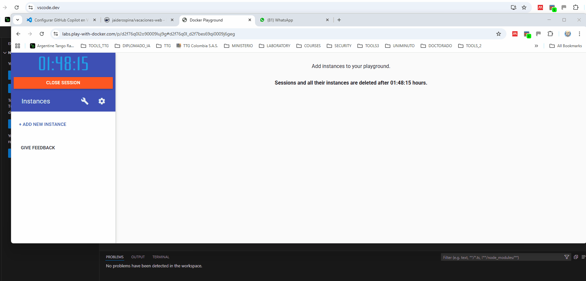
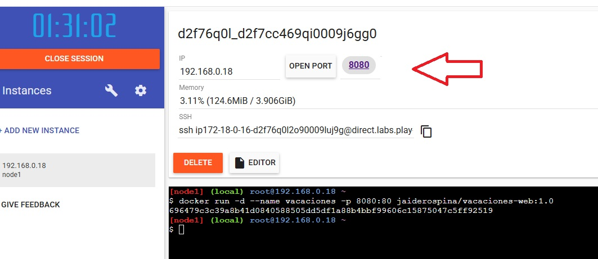
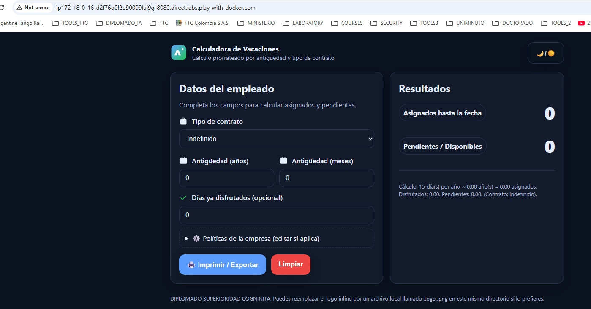

# Consumir desde https://labs.play-with-docker.com/


1. Ingrese a:

- https://labs.play-with-docker.com/

Cree una nueva instancia.

2. Copie el contenedor desde:
- https://hub.docker.com/r/jaiderospina/vacaciones-web

3. Ejecute en play with docker '

```
docker pull jaiderospina/vacaciones-web:1.0


docker run -d --name vacaciones -p 8080:80 jaiderospina/vacaciones-web:1.0
```




**El sistema abre el puerto 8080**



**El sistema abre una nueva ventana con la aplicación**



