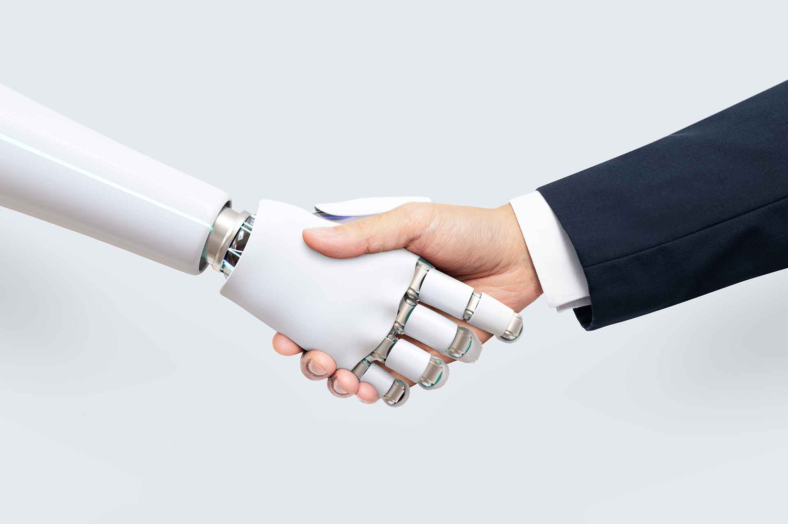

# DIPLOMADO_IA_2025

Al finalizar esta materia, los participantes serán capaces de diseñar e implementar soluciones de inteligencia artificial en la gestión de recursos humanos, considerando los aspectos éticos y de ciberseguridad, para optimizar la toma de decisiones, fortalecer el talento y cultivar una ventaja cognitiva sostenible en la organización.

.
