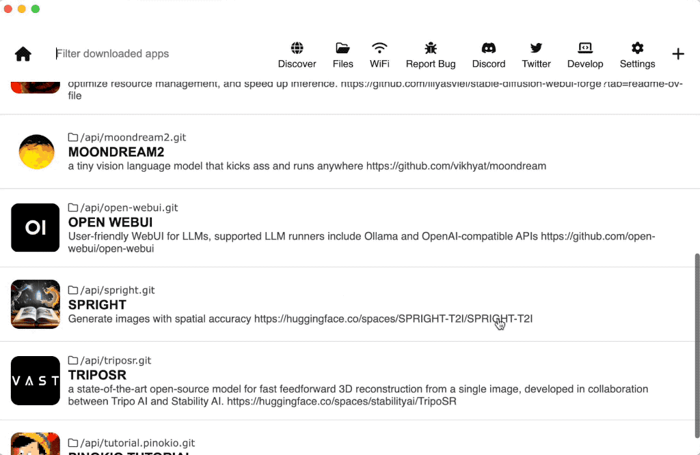

# Herramientas.

1. ##  Mapas Mentales
   - https://www.min87.com/tools/markmap/
   - https://markmap.js.org/repl
## Pinokio.
Pinokio es un navegador que permite a los usuarios instalar, ejecutar y gestionar cualquier aplicación de servidor de forma local con un solo clic. Funciona como un "hub" o centro de control para diversas herramientas y modelos de inteligencia artificial, lo que simplifica enormemente el proceso de configuración y ejecución.

### Versatilidad y Utilidad
La principal fortaleza de Pinokio es su versatilidad. No se limita a una sola función, sino que actúa como una plataforma para ejecutar una amplia variedad de aplicaciones. Esto lo convierte en una herramienta muy útil para desarrolladores, creadores y entusiastas de la IA que desean experimentar con diferentes modelos sin la necesidad de configuraciones complejas. Su utilidad radica en:

* **Simplificación de la instalación:** Permite a los usuarios instalar aplicaciones de servidor complejas con un solo clic.
* **Gestión centralizada:** Ofrece un lugar único para gestionar y ejecutar diversas herramientas.
* **Amplia gama de aplicaciones:** Soporta una gran cantidad de modelos de IA para tareas como texto a voz, generación de video, edición de imágenes, etc.

### Casos de Uso
Los casos de uso de Pinokio son muy variados, cubriendo diferentes áreas de la creación digital y la inteligencia artificial:

* **Generación de audio:** Se puede usar para ejecutar modelos de texto a voz como OpenAudio, Dia y Orpheus-TTS-FastAPI, que ofrecen clonación de voz y control de emociones.
* **Creación de video:** Herramientas como FramePack, MatAnyone y VideoCrafter 2 permiten la generación de video, la eliminación de fondos y la creación de video a partir de texto o imágenes.
* **Edición y creación de imágenes:** Facilita la ejecución de aplicaciones como FaceFusion, MagicQuill e InstantIR para la generación y edición de imágenes.
* **Contenido 3D:** Es útil para la creación de inteligencia y contenido 3D con herramientas como Hunyuan3D-2-LowVRAM y cube.
* **Agentes de IA:** Permite la gestión de agentes de IA generales y aplicaciones web como AutoGPT y bolt.diy.

### Utilidades Similares
Dado que Pinokio es una plataforma para ejecutar y gestionar aplicaciones de IA de forma local, es diferente de los asistentes virtuales mencionados en mi respuesta anterior. Sin embargo, en el contexto de la ejecución de código y la gestión de proyectos, algunas herramientas que comparten una funcionalidad similar en diferentes aspectos podrían ser:

* **Anaconda/Miniconda:** Para la gestión de entornos y paquetes de Python, es una herramienta común en el desarrollo de IA.
* **Docker:** Una plataforma que permite empaquetar aplicaciones y sus dependencias en contenedores, lo que facilita la ejecución en cualquier entorno.
* **GitHub Desktop:** Para la gestión de repositorios de código, aunque no ejecuta aplicaciones directamente, ayuda a gestionar las bases de código que pueden contener estas herramientas.

# Instalación.

- https://pinokio.co/docs/#/?id=install

